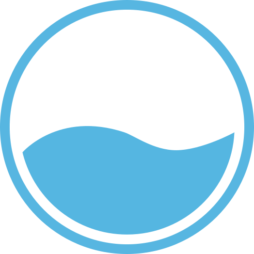

<!-- Social links go here -->

    

 
 

<!-- Logo and title goes here -->

    
    <h2 align="center" style="font-size: 32px; font-weight: 500;">Haudal</h2>
    
        A developer focused, open-soruce based and free to use community project
    
     
     
    <a href="https://github.com/github_username/repo_name">COMMING SOON</a>
    ·
    <a href="https://github.com/github_username/repo_name/issues">COMMING SOON</a>
    ·
    <a href="https://github.com/github_username/repo_name/issues">COMMING SOON</a>

 
 

<!-- TABLE OF CONTENTS -->

  
Table of Contents

  <ol>
    <li>
      <a href="#about-the-project">About The Project</a>
      <ul>
        <li><a href="#built-with">Built With</a></li>
        <li><a href="#motivaiton">Motivation</a></li>
      </ul>
    </li>
    <li>
      <a href="#getting-started">COMMING SOON</a>
      <ul>
        <li><a href="#prerequisites">COMMING SOON</a></li>
        <li><a href="#installation">COMMING SOON</a></li>
      </ul>
    </li>
    <li><a href="#usage">COMMING SOON</a></li>
    <li><a href="#roadmap">COMMING SOON</a></li>
    <li><a href="#contributing">COMMING SOON</a></li>
    <li><a href="#license">COMMING SOON</a></li>
    <li><a href="#contact">COMMING SOON</a></li>
  </ol>

 
 

<!-- About section -->
## About the project
This project was started with a real problem in mind; __Authentication implementation in web development.__ It has always been a struggle to spend several work hours creating a full fledged OAuth-a-like system for your REST API for each new project.

 

So, the initial goal of Haudal was to create a system that could be reused and/or modified per ones project needs. As the time went, the project grew bigger, and now it is not only an authentication service, but rather a community project that will *(in theory)* have several easy-to-integrate services ready for use.

 
 

### Built with
This list of technologies used is not meant to be organized in any way shape or form. Therefore, please refer to a sub directory of __codebase/__ to find out what a given service in based upon.

 

    

        
        
        
        
        
        
        
        
        
        
        
        
    

 
 

### Motivaiton
The main motivation of this project was to learn and practice the whole development process as a fullstack developer. I also wanted to add DevOps skills to my CV; Therefore I've landed on a tech stack that includes on-prem deployment and other relevant DevOps skills. My goal was to:
* Learn __Kubernetes__ and host an on-prem cluster running strictly [my own](https://github.com/arseniskobelev) software 
* Expand my previous knowledge on __Docker__
* Create a project that would *(in theory)* land me a job as a software developer after my apprenticeship